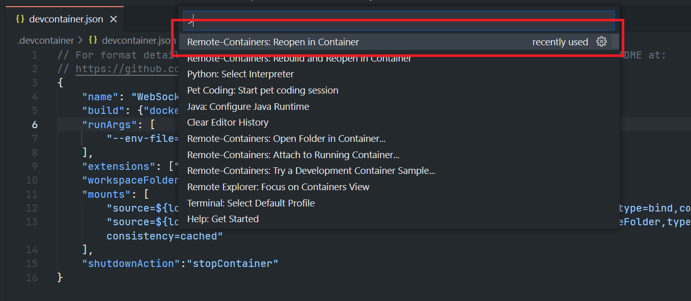

# Develop with Refinitiv WebSocket API Docker Image with C# in VS Code Using the Remote - Containers extension
- version: 1.0.0
- Last update: April 2022
- Environment: Docker
- Compiler: C#
- Prerequisite: [Demo prerequisite](#prerequisite)

Example Code Disclaimer:
ALL EXAMPLE CODE IS PROVIDED ON AN “AS IS” AND “AS AVAILABLE” BASIS FOR ILLUSTRATIVE PURPOSES ONLY. REFINITIV MAKES NO REPRESENTATIONS OR WARRANTIES OF ANY KIND, EXPRESS OR IMPLIED, AS TO THE OPERATION OF THE EXAMPLE CODE, OR THE INFORMATION, CONTENT, OR MATERIALS USED IN CONNECTION WITH THE EXAMPLE CODE. YOU EXPRESSLY AGREE THAT YOUR USE OF THE EXAMPLE CODE IS AT YOUR SOLE RISK.

## <a id="intro"></a>Introduction

[Visual Studio Code](https://code.visualstudio.com/) (or just VS Code) is a free source code editor developed and maintained by [Microsoft](https://github.com/Microsoft/vscode). This cross-platform editor rapidly gained popularity with developers as it is fast and lightweight, supports a variety of programming languages with IntelliSense (a feature that has originated with VS Code’s older sibling, Visual Studio IDE), and enables complete development operations like debugging, task running, and version control.

VS Code provides numerous extensions that add features and expand development workflows like the [remote development](https://code.visualstudio.com/docs/remote/remote-overview) that lets developers use a container, remote machine, or the [Windows Subsystem for Linux (WSL)](https://developers.refinitiv.com/en/article-catalog/article/coding-testing-linux-apps-on-windows-with-wsl-windows-subsystem-for-linux) as a full-featured development environment with the [Remote Development Extension Pack](https://marketplace.visualstudio.com/items?itemName=ms-vscode-remote.vscode-remote-extensionpack). 

As part of the Remote Development Extension Pack, the [Remote - Containers](https://marketplace.visualstudio.com/items?itemName=ms-vscode-remote.remote-containers) extension lets developers use a Docker container as an immutable/sandbox development environment. It allows the developers to open any folder inside (or mounted into) a container and take advantage of Visual Studio Code's full feature set (IntelliSense, code navigation, debugging, etc) as a local-quality development experience. This feature is called *devcontainer* or *dev container*.


The previous [Article.RTSDK.Java.Cpp.DevContainer](https://github.com/Refinitiv-API-Samples/Article.RTSDK.Java.Cpp.DevContainer) project demonstrates how to use Refinitiv Real-Time SDK Java/C++ Docker Images devcontainer with VS Code Remote - Containers extension. This example project shows how to set up a [.NET](https://dotnet.microsoft.com/en-us/) (to be precisely, [.NET Core](https://github.com/dotnet/core)) devcontainer with the Remote - Containers extension to for the Refinitiv Real-Time Optimized (RTO) [C#](https://docs.microsoft.com/en-us/dotnet/csharp/) WebSocket examples [using a Dockerfile](https://code.visualstudio.com/docs/remote/create-dev-container#_dockerfile). This Dockerfile is built on top of the [refinitivapis/websocket_api](https://hub.docker.com/r/refinitivapis/websocket_api) Docker Image and developers can run the RTO C# WebSocket examples codes directly in VS Code.

## <a id="Introduction"></a>Refinitiv WebSocket API Introduction

As part of the [Refinitiv Real-Time SDK](https://developers.refinitiv.com/en/use-cases-catalog/refinitiv-real-time), the [Websocket API for Pricing Streaming and Real-Time Service](https://developers.refinitiv.com/en/api-catalog/refinitiv-real-time-opnsrc/refinitiv-websocket-api) (aka Websocket API) provides a connection to Refinitiv Real-Time via a standard WebSocket protocol and JSON message format. Developers can use multiple client technology standards such as Python, JavaScript, .Net, etc. to establish WebSocket connections to Refinitiv Real-Time Distribution Systems (RTDS), or Refinitiv Real-Time - Optimized (RTO - cloud solution) available via Refinitiv Data Platform (RDP). 

The WebSocket API examples source code for various programming languages is available on [GitHub](https://github.com/Refinitiv/websocket-api). If developers are new to the Refinitiv Real-Time, they can use the [refinitivapis/websocket_api](https://hub.docker.com/r/refinitivapis/websocket_api) Docker Image to learn the WebSocket API and RTO connection flows quickly. This Docker image contains all WebSocket API Examples, the Python runtime, and dependencies required to run the Python WebSocket examples. You can check my colleague's [Introduction to the refinitivapis/websocket_api Docker Image](https://developers.refinitiv.com/en/article-catalog/article/introduction-to-the-refinitivapis-websocketapi-docker-image) article for step-by-step guidance on how to deploy and run the RTSDK Docker images via Docker command line.

If you are using the Refinitiv Real-Time SDK C/C++ or Java,  there are the following Docker images that contain the latest version SDK too.
 * [refinitivapis/realtimesdk_c](https://hub.docker.com/r/refinitivapis/realtimesdk_c): This docker image contains the latest version of the RTSDK C/C++ libraries and examples. 
 * [refinitivapis/realtimesdk_java](https://hub.docker.com/r/refinitivapis/realtimesdk_java): This docker image contains the latest version of the RTSDK Java libraries and examples. 


## <a id="prerequisite"></a>Demo prerequisite
This example requires the following dependencies software and libraries.
1. [Visual Studio Code](https://code.visualstudio.com/) editor.
2. [Docker Desktop/Engine](https://docs.docker.com/get-docker/) application.
3. [VS Code - Remote Development extension pack](https://aka.ms/vscode-remote/download/extension)
4. Access to the Refinitiv Refinitiv Data Platform and Refinitiv Real-Time - Optimized. (for the RTO example only)
5. Internet connection. 

I highly recommend following [System requirements](https://code.visualstudio.com/docs/remote/containers#_system-requirements) and [Installation](https://code.visualstudio.com/docs/remote/containers#_installation) sections to set up your environment.

Please contact your Refinitiv representative to help you to access the RTO account and services. You can find more detail regarding the RDP and RTO access credentials set up from the *Getting Started for Machine ID* section of the [Getting Start with Refinitiv Data Platform article](https://developers.refinitiv.com/en/article-catalog/article/getting-start-with-refinitiv-data-platform) article.  


## <a id="devcontainer_detail"></a>RTO C# devcontainer Detail

Please see the full details over the RTO C# devcontainer implementation on the [WebSocketAPI_DevContainer.md](WebSocketAPI_DevContainer.md) file.

##  <a id="project_files"></a>Project files
This example project contains the following files and folders
1. *.devcontainer/devcontainer.json*: An example devcontainer configuration file.
2. *.devcontainer/Dockerfile*: An example Dockerfile.
3. *.devcontainer/.env.devcontainer.example*: An example ```.env.devcontainer``` file.
4. *.vscode*: VS Code debugging configurations for the RTO C# WebSocket example.
5. *images*: Project images folder.
6. *LICENSE.md*: Project's license file.
7. *README.md*: Project's README file.
8. *WebSocketAPI_DevContainer.md*: Project's Document file.

## <a id="how_to_run"></a>How to run the Examples

The first step is to unzip or download the example project folder into a directory of your choice, then follow the steps below.

1. Go to the project's *.devcontainer* folder and create a file name ```.env.devcontainer```  with the following content.
    ```
    RTO_USERNAME=<RTO Machine-ID>
    RTO_PASSWORD=<RTO Password>
    RTO_CLIENTID=<RTO AppKey>
    ```
2. Start a Docker desktop or Docker engine on your machine.
3. Open the project folder in the VS Code editor
4. Install the [VS Code - Remote Development extension pack](https://aka.ms/vscode-remote/download/extension).
5. Open the VS Code Command Palette with the ```F1``` key, and then select the **Remote-Containers: Reopen in Container** command.



Now VS Code is ready to run the RTO C# WebSocket devcontainer. 


## <a id="troubleshooting"></a>Troubleshooting

**Question**: I do not have the RTO credentials.

**Answer**: Please contact your Refinitiv representative to help you to access the RTO account and services.

**Question**: When I select the *Remote-Containers: Reopen in Container* command, VS Code returns an error with **Docker returned an error. Make Sure the Docker daemon is running.** message.

**Answer**: Please install and start a Docker desktop or Docker engine on your machine.

**Question**: When I select the *Remote-Containers: Reopen in Container* command, VS Code returns an error with **Docker returned an error. Make Sure the Docker daemon is running.** message.

**Answer**: Please install and start a Docker desktop or Docker engine on your machine.

**Question**: VS Code throws an error with the **An error occurred setting up the container** message.


**Answer**: Please choose the *Open devcontainer.json Locally* option. Delete Docker container and images (named *vsc-XXX*), check the error log file, and restart the process.

**Question**: VS Code throws an error and the log show **docker: open .devcontainer/.env.devcontainer: The system cannot find...* message.


**Answer**: This error message means you do not have a ```.dev.devcontainer``` environment variables file in the ```.devcontainer``` folder. Please create it using the template from a ```.dev.devcontainer.example``` file.

## <a id="conclusion"></a>Conclusion and Next Steps

Docker is an open containerization platform for developing, testing, deploying, and running any software application. It helps developers create a consistent development environment (aka devcontainer) without manually maintaining dependencies and toolsets for the project. The VS Code [Remote - Containers](https://marketplace.visualstudio.com/items?itemName=ms-vscode-remote.remote-containers) lets developers develop applications with a devcontainer using VS Code full-featured sets such as debugging and various extensions. This devcontainer is easy to set up and share among the project team. 

This example project is just a brief introduction to the Remote - Containers extension. Developers can work with [Docker Compose](https://code.visualstudio.com/docs/remote/create-dev-container#_use-docker-compose) to build a customized Docker image that matches the development requirements, [debugging](https://code.visualstudio.com/docs/remote/containers#_debugging-in-a-container), install various VS Code extensions to use in the Dev Container (via the [GUI](https://code.visualstudio.com/docs/remote/containers#_managing-extensions) or [configuration file](https://code.visualstudio.com/docs/remote/containers#_adding-an-extension-to-devcontainerjson)), [clone Docker container from Git repository](https://code.visualstudio.com/docs/remote/containers#_quick-start-open-a-git-repository-or-github-pr-in-an-isolated-container-volume), [attach the VS Code to a running container](https://code.visualstudio.com/docs/remote/containers#_attach-to-existing-container), [port forwarding](https://code.visualstudio.com/docs/remote/containers#_always-forwarding-a-port), and much more. I highly recommend you check the following VS Code resources for more details:
* [Developing inside a Container](https://code.visualstudio.com/docs/remote/containers)
* [Remote development in Containers tutorial](https://code.visualstudio.com/docs/remote/containers-tutorial)
* [Create a development container](https://code.visualstudio.com/docs/remote/create-dev-container)
* [devcontainer.json reference](https://code.visualstudio.com/docs/remote/devcontainerjson-reference)


The [refinitivapis/websocket_api](https://hub.docker.com/r/refinitivapis/websocket_api) Docker Image is a good starting point for developers who are new to the [Websocket API](https://developers.refinitiv.com/en/api-catalog/refinitiv-real-time-opnsrc/refinitiv-websocket-api)). Developers can use the Docker Image with the Remote - Containers extensions to set up a development environment, and run the Python WebSocket examples. Developers who are using other programming languages can install more compilers/runtime to run the WebSocket examples based on their preferred technology too.

## <a id="ref"></a>References

For further details, please review the following resources:
* [Websocket API](https://developers.refinitiv.com/en/api-catalog/refinitiv-real-time-opnsrc/refinitiv-websocket-api) on the [Refinitiv Developer Community](https://developers.refinitiv.com/) website.
* [Refinitiv Real-Time & Distribution Family page](https://developers.refinitiv.com/en/use-cases-catalog/refinitiv-real-time) page.
* [Websocket API Quick Start](hhttps://developers.refinitiv.com/en/api-catalog/refinitiv-real-time-opnsrc/refinitiv-websocket-api/quick-start) page.
* [Developer Article: 10 important things you need to know before you write an Enterprise Real Time application](https://developers.refinitiv.com/article/10-important-things-you-need-know-you-write-elektron-real-time-application) article.
* [Introduction to the refinitivapis/websocket_api Docker Image](https://developers.refinitiv.com/en/article-catalog/article/introduction-to-the-refinitivapis-websocketapi-docker-image) article.
* [VS Code: Developing inside a Container](https://code.visualstudio.com/docs/remote/containers) page.
* [VS Code: Remote development in Containers tutorial](https://code.visualstudio.com/docs/remote/containers-tutorial) page.
* [VS Code: Create a development container](https://code.visualstudio.com/docs/remote/create-dev-container) page.
* [VS Code: devcontainer.json reference](https://code.visualstudio.com/docs/remote/devcontainerjson-reference) page.
* [VS Code: Create a development container: Dockerfile](https://code.visualstudio.com/docs/remote/create-dev-container#_dockerfile) page.
* [VS Code: Debugging and Task Variables reference](https://code.visualstudio.com/docs/editor/variables-reference) page.
* [VS Code: Remote Development: Environment variables reference](https://code.visualstudio.com/remote/advancedcontainers/environment-variables) page.
* [Try Out Development Containers: .NET Core](https://github.com/microsoft/vscode-remote-try-dotnetcore) page.
* [Docker run reference](https://docs.docker.com/engine/reference/commandline/run/) page.
* [Dockerfile reference](https://docs.docker.com/engine/reference/builder/) page.
* [Setting up a VS Code Dev Container](https://benmatselby.dev/post/vscode-dev-containers/) blog post.
* [Hands-On with VSCode & "Dev Containers"](https://dev.to/mcastellin/hands-on-with-vscode-dev-containers-33bf) blog post.
* [Development Acceleration Through VS Code Remote Containers: An Introduction](https://stelligent.com/2020/03/20/development-acceleration-through-vs-code-remote-containers-an-introduction/) blog post.
* [Secure and immutable development environments with Dev Containers](https://kerkour.com/secure-programming-with-vscode-dev-containers) blog post.

For any questions related to this project or the WebSocket API page, please use the Developer Community [Q&A Forum](https://community.developers.refinitiv.com/spaces/152/websocket-api.html).