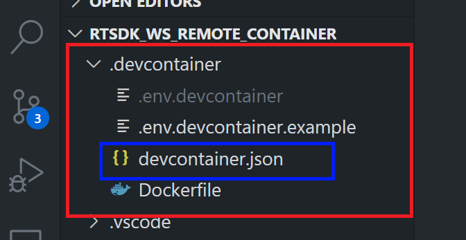
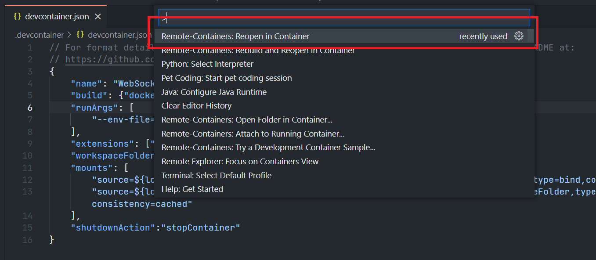
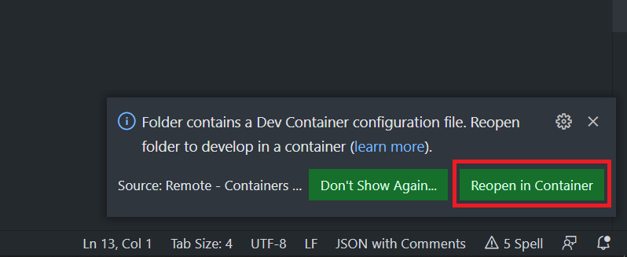
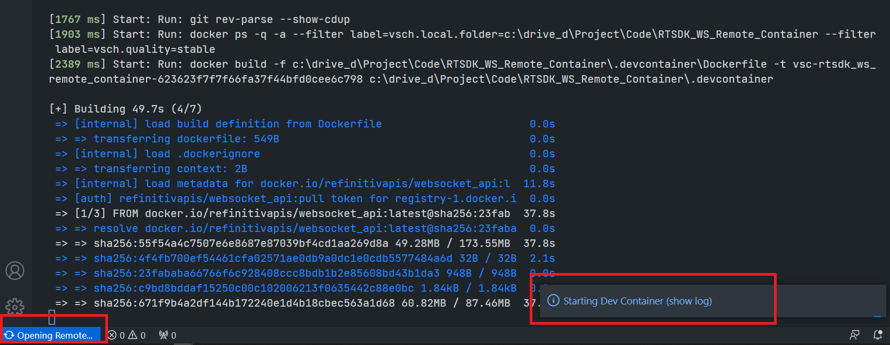
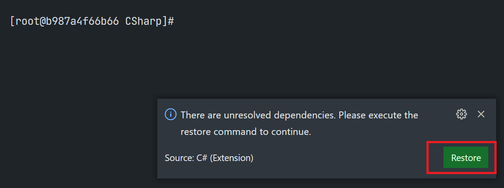
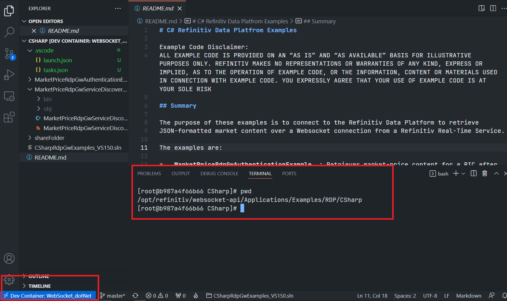
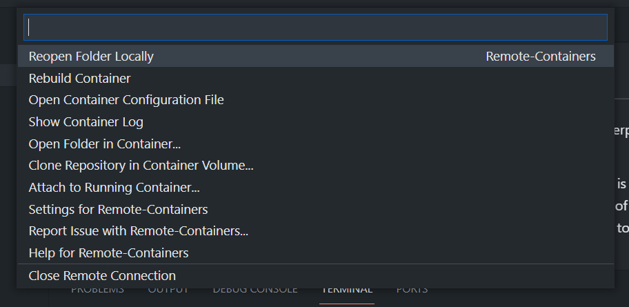
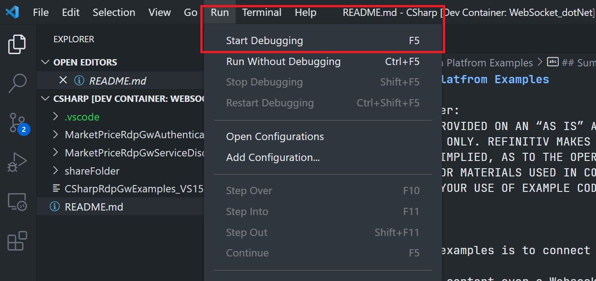

# Develop with Refinitiv WebSocket API Docker Image with C# in VS Code Using the Remote - Containers extension
- version: 1.0.0
- Last update: April 2022
- Environment: Docker
- Compiler: C#
- Prerequisite: [Demo prerequisite](#prerequisite)

Example Code Disclaimer:
ALL EXAMPLE CODE IS PROVIDED ON AN “AS IS” AND “AS AVAILABLE” BASIS FOR ILLUSTRATIVE PURPOSES ONLY. REFINITIV MAKES NO REPRESENTATIONS OR WARRANTIES OF ANY KIND, EXPRESS OR IMPLIED, AS TO THE OPERATION OF THE EXAMPLE CODE, OR THE INFORMATION, CONTENT, OR MATERIALS USED IN CONNECTION WITH THE EXAMPLE CODE. YOU EXPRESSLY AGREE THAT YOUR USE OF THE EXAMPLE CODE IS AT YOUR SOLE RISK.

## <a id="devcontainer_json"></a>A devcontainer.json file

The main configuration file that tells VS Code how to access (or create) a devcontainer with a well-defined tool and runtime stack is named the ```devcontainer.json``` file. The dev container configuration is either located under ```.devcontainer/devcontainer.json``` or stored in a file named ```.devcontainer.json``` file (*note the dot-prefix*) in the root of the project.



**Note**: Make sure to commit a ```.devcontainer``` folder to your version control system.

Let me explain these configurations:

```
// For format details, see https://aka.ms/devcontainer.json. For config options, see the README at:
// https://github.com/microsoft/vscode-dev-containers/tree/v0.202.5/containers/
{
    "name": "WebSocket_dotNet",
    "build": {"dockerfile": "Dockerfile"},
    "runArgs": [
        "--env-file=.devcontainer/.env.devcontainer"
    ],
    "extensions": ["ms-dotnettools.csharp"],
    "workspaceFolder": "/opt/refinitiv/websocket-api/Applications/Examples/RDP/CSharp",
    "mounts": [
        "source=${localWorkspaceFolder}/.vscode,target=${containerWorkspaceFolder}/.vscode,type=bind,consistency=cached",
        "source=${localWorkspaceFolder}/shareFolder,target=${containerWorkspaceFolder}/shareFolder,type=bind,consistency=cached"
    ],
    "shutdownAction":"stopContainer"
}
```
The detail of the configurations above are:
- ```name```: A display name for the container.
- ```build```: The location of a [Dockerfile](https://docs.docker.com/engine/reference/builder/) that defines the contents of the container.
- ```runArgs```: An array of [Docker CLI arguments](https://docs.docker.com/engine/reference/commandline/run/) that VS Code uses when running the container. I am setting the ```--env-file``` option that sets the container's environment variables via a file named *.env.devcontainer*.
- ```extensions```: Specify VS Code extension IDs that will be installed inside the container.I am setting [C# extension for Visual Studio Code](https://marketplace.visualstudio.com/items?itemName=ms-dotnettools.csharp).
- ```workspaceFolder```: Sets the default path that VS Code should open when connecting to the container. This devcontainer sets the default path to **/opt/refinitiv/websocket-api/Applications/Examples/RDP/CSharp** which is the RTO C# examples location in the container.
- ```mounts```: Add mount points to the container when created for sharing files between the host and devcontainer. I am mounting the ```.vscode``` folder for the C# running/debugging configurations and the ```shareFolder``` to share files between host and devcontainer.
- ```shutdownAction```: set the VS Code stops the container when the editor window is closed/shut down.

The development container is not limited to Docker Images or a Dockerfile, it supports [Docker Compose](https://code.visualstudio.com/docs/remote/create-dev-container#_use-docker-compose) too. You can build your image(s) to match your development requirements, and then share ```Dockerfile``` and/or ```docker-compose.yml``` inside a ```.devcontainer``` folder (with a ```devcontainer.json``` file) with your colleagues to help them to set up the same development environment.

Please find more details about all devcontainer.json configuration parameters on the [VS Code - devcontainer.json reference](https://code.visualstudio.com/docs/remote/devcontainerjson-reference) page.

## <a id="devcontainer_dockerfile"></a>A Dockerfile

The refinitivapis/websocket_api Docker Image has the Python runtime and dependencies pre-installed for the Python WebSocket examples. However, it is based on the Linux OS Image, so we can build a new Docker image on top of it and install compilers, SDKs, or runtime for the other WebSocket examples.

A Dockerfile for the RTO C# WebSocket examples is as follows:

```
# Pulling Image from https://hub.docker.com/r/refinitivapis/websocket_api
FROM refinitivapis/websocket_api:latest
LABEL maintainer="Developer Advocate"

# Install updates, dotnet-sdk and tools for VS Code devcontainer.
RUN yum update -y \
 && yum -y install dotnet-sdk-2.1 wget tar.x86_64 \
 # Clean up unnecessary files to reduce Image size
 && yum clean all
# Set work directory to be RDP/CSharp

WORKDIR /opt/refinitiv/websocket-api/Applications/Examples/RDP/CSharp

# Set Docker to start bash
CMD /bin/bash
```
The above Dockerfile instructions do the following tasks.
1. Pull refinitivapis/websocket_api as the [Base Image](https://docs.docker.com/glossary/#base-image) with the ```FROM``` instruction.
2. Install .NET SDK and runtime to the Image (**As of April 2022**: The RTO C# examples support .NET Core *version 2.1*).
3. Install additional packages for VS Code and the Remote - Containers extension.
4. Set a new working directory to */opt/refinitiv/websocket-api/Applications/Examples/RDP/CSharp* folder with the ```WORKDIR``` instruction.

Please note that you can build and run this Dockerfile with the Docker engine CLI too.

## <a id="devcontainer_envfile"></a>A Environment Variables file

According to the methodology [3rd factor](https://12factor.net/config) of the [Twelve-Factor App methodology](https://12factor.net/), it is a good practice to keep configuration information and credentials as environment variables, then inject them into the application on runtime. 

I am keeping the RTO credentials in a file named ```.env.devcontainer``` file under the ```.devcontainer``` folder as follows:

```
# RTO Credentials
RTO_USERNAME=<RTO Machine-ID>
RTO_PASSWORD=<RTO Password>
RTO_CLIENTID=<RTO AppKey>
```
Then, we set this ```.env.devcontainer``` file to Docker on runtime with the devcontainer.json's ```"runArgs": ["--env-file=.devcontainer/.env.devcontainer"]``` configuration. Once the devcontainer creation is successful, developers can access RTO credentials via the following methods:
* In a container's bash: via the ```$<variable name>``` syntax like ```$RTO_USERNAME```
* In VS Code launch.json: via the ```${env:<variable name>}``` syntax like ```${env:RTO_USERNAME}```

### Caution

You **should not** share this ```.env.devcontainer``` file to your peers or commit/push it to the version control. You should add the file to the ```.gitignore``` file to avoid adding it to version control or public repository accidentally.

You can create a ```.env.devcontainer.example``` file as a template for environment variables file sharing. The file has the same parameters' keys as a ```.env.devcontainer``` file but without sensitive values.

## <a id="devcontainer_launchfile"></a>Launch and Tasks Configurations files

VS Code has built-in debugging support for various programming languages. Developers can configure and save their debugging setup detail in a lunch configuration file named ```launch.json``` located in a ```.vscode``` folder of the workspace (project root folder). 

To set a devcontainer to run and debug the MarketPriceRdpGwServiceDiscoveryExample application with the .NET Core runtime, I am setting a launch.json configuration as follows:

```
{
    "version": "0.2.0",
    "configurations": [

        {
            // Use IntelliSense to find out which attributes exist for C# debugging
            // Use hover for the description of the existing attributes
            // For further information visit https://github.com/OmniSharp/omnisharp-vscode/blob/master/debugger-launchjson.md
            "name": ".NET Core Launch (console)",
            "type": "coreclr",
            "request": "launch",
            "preLaunchTask": "build",
            // If you have changed target frameworks, make sure to update the program path.
            "program": "${workspaceFolder}/MarketPriceRdpGwServiceDiscoveryExample/bin/Debug/netcoreapp2.1/MarketPriceRdpGwServiceDiscoveryExample.dll",
            "args": ["--user","${env:RTO_USERNAME}","--password","${env:RTO_PASSWORD}","--clientid","${env:RTO_CLIENTID}","--ric","/EUR="],
            "cwd": "${workspaceFolder}/MarketPriceRdpGwServiceDiscoveryExample",
            ...
        },
        ...
    ]
}
```

Please noticed that the ```args``` attribute has been set with the ```["--user","${env:RTO_USERNAME}","--password","${env:RTO_PASSWORD}","--clientid","${env:RTO_CLIENTID}","--ric","/EUR="]``` value. This setting makes VS Code automatic passes the RTO credentials in a devcontainer's environment variables to the MarketPriceRdpGwServiceDiscoveryExample command line options. Developers do not need to manual paste their credentials in a devcontainer anymore.

Developers can save their building, packaging, testing, or deploying steps in a tasks configuration file named ```tasks.json``` located in a ```.vscode``` folder of the workspace (project root folder). A tasks.json file for automatic builds of the RTO C# WebSocket CSharpRdpGwExamples_VS150 solution with the following configurations:

```{
    "version": "2.0.0",
    "tasks": [
        {
            "label": "build",
            "command": "dotnet",
            "type": "process",
            "args": [
                "build",
                "${workspaceFolder}/CSharpRdpGwExamples_VS150.sln",
                "/property:GenerateFullPaths=true",
                "/consoleloggerparameters:NoSummary"
            ],
            "problemMatcher": "$msCompile"
        },
        ....
    ]
}
```

We mount this ```.vscode``` folder to a Docker Container with the devcontainer.json's ```"mounts": ["source=${localWorkspaceFolder}/.vscode,target=${containerWorkspaceFolder}/.vscode,type=bind,consistency=cached"]``` configuration. Once the devcontainer creation is successful, developers can start run and debug RTO C# Websocket examples session in VS Code directly.

Please find more detail about VS Code Debugging and Tasks configurations from the following resources:
- [VS Code: Debugging User Guide](https://code.visualstudio.com/docs/editor/debugging).
- [VS Code: Integrate with External Tools via Tasks](https://code.visualstudio.com/docs/editor/tasks).
- [Configuring launch.json for C# debugging](https://github.com/OmniSharp/omnisharp-vscode/blob/master/debugger-launchjson.md).
- [Console (terminal) window setting](https://github.com/OmniSharp/omnisharp-vscode/blob/master/debugger-launchjson.md#console-terminal-window).

### <a id="start_dev_container"></a>Running the Development Container

**Docker Desktop/engine should be running before the next step.**

You can connect to the container and start developing within it by selecting the **Remote-Containers: Reopen in Container** command from the VS Code Command Palette (F1).



Alternatively, the VS Code can detect whether there is a folder containing a Dev container configuration file, and then asks you if you want to reopen the folder in a container.



Next, the VS Code window (instance) reloads and builds a Docker image from a Dockerfile, then starts a devcontainer. Please note that if the image is already built, the process will be faster.



There may be a message “There are unresolved dependencies. Please execute the restore command to continue” At this point. This message is generated from VS Code C# extension. Please click the Restore button.



Once this build completes, VS Code automatically connects to the container at the path we set to the ```workspaceFolder``` property which is the **/opt/refinitiv/websocket-api/Applications/Examples/RDP/CSharp** folder.  You can check the VS Code Remote connection status from the button left toolbar.



If you click this toolbar, VS Code shows the Container Remote connection menu options at the top of the editor.



To close the remote connection, choose the "Close Remote Connection" from the drop-down menu. 

### <a id="start_dev_container"></a>Running the MarketPrice RDP Service Discovery Example

This devcontainer already has the C# extension built-in and VS Code's launch.json and tasks.json configurations files, developers can run the MarketPrice RDP Service Discovery Example (MarketPriceRdpGwServiceDiscoveryExample) by pressing the ```F5``` button or selecting *Run* then *Start Debugging* option from VS Code menu.



VS Code automatic runs the MarketPriceRdpGwServiceDiscoveryExample application with the ```--user```, ```--password```, ```--clientid```, and ```--ric``` command-line options set in a launch.json file. All RTO credentials are available in the container environment variables, so developers do not need to manually set them. Developers can change the RIC code or add other options in the ```args``` attribute of a launch.json file. 

```
//launch.json file
{
    "version": "0.2.0",
    "configurations": [

        {
           
            "name": ".NET Core Launch (console)",
            ...
            "args": ["--user","${env:RTO_USERNAME}","--password","${env:RTO_PASSWORD}","--clientid","${env:RTO_CLIENTID}","--ric","/EUR="],
            ...
        },
        ...
    ]
}
```
Please find more detail about other options in the solution readme file.

Alternatively, developers can run the example in bash manually via the following steps:

```
$>dotnet build CSharpRdpGwExamples_VS150.sln

$>cd MarketPriceRdpGwServiceDiscoveryExample/bin/Debug/netcoreapp2.1/

$>dotnet MarketPriceRdpGwServiceDiscoveryExample.dll --user $RTO_USERNAME --password $RTO_PASSWORD --clientid $RTO_CLIENTID --ric <RIC Code>
```

### <a id="run_python"></a>Bonus: Running the WebSocket Python examples

This C# devcontainer is based on the refinitivapis/websocket_api Docker Image, so developers can run the Python WebSocket examples too.

The steps to run the RTO Python WebSocket example are as follows:

```
$>cd /opt/refinitiv/websocket-api/Applications/Examples/RDP/python

$> python market_price_rdpgw_service_discovery.py --user $RTO_USERNAME --password $RTO_PASSWORD --clientid $RTO_CLIENTID --ric <RIC Code>
```